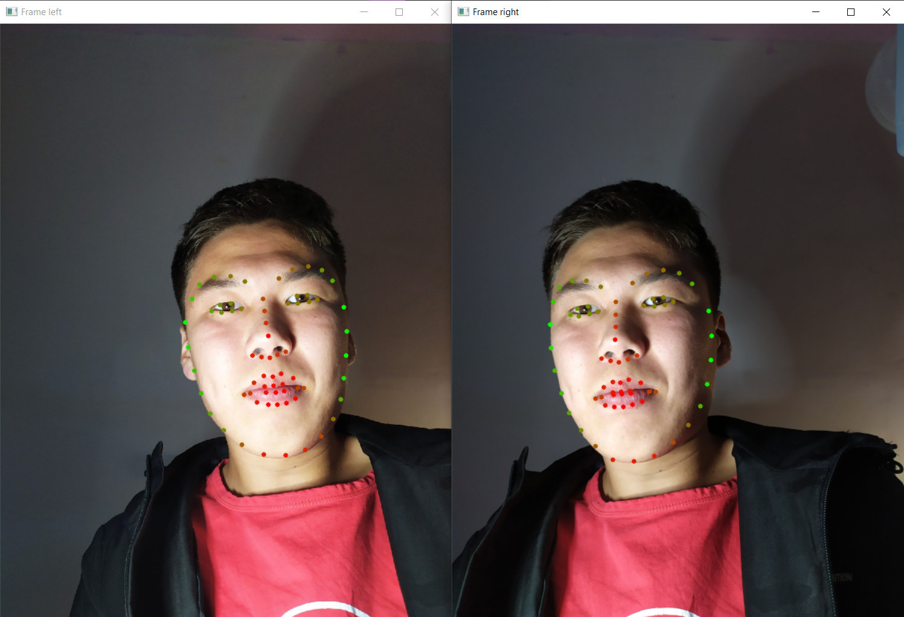

# Расстояние до объекта

Здесь описаны небольшие попытки сделать программу, вычисляющую расстояние до объектов, используя стереоизображение. 

## Использование точек лица

Наибольший упор был сделан на вычисление расстояния до лица человека, для того чтобы узнать положение головы в пространстве.
Для этого использовались такие библиотеки:

* opencv2 для ввода, редактирования и вывода изображений
* dlib для распознавания точек лица

Алгоритм простой:

* Захватываем кадр с двух камер, расположенных в одной плоскости, смотрящих в одно направление.
* Находим на кадрах точки на лице человека
* Находим угол каждой точки относительно направления камер, используя данные о камерах (разрешение, угол обзора)
* Находим для соответствующих точек их расстояние до плоскости камер, используя данные о двух углах до точек и расстоянию между камерами

Для этого была написана библиотека, состоящая из двух классов – камера и стереокамера. Библиотека [stereocam.py](stereocam.py)
Демонстрация работы которой показана в скрипте [testonimages.py](testonimages.py)

## Метод поиска ключевых точек

Тесты не принесли положительных результатов, но гайд как использовать ORB показан в скрипте [ORB_test.py](ORB_test.py)

## Использование opencv 

Для получения карты глубины в opencv есть решения. Однако они показывают плохие результаты.
Демонстрация показана в скрипте [StereoBM_test.py](StereoBM_test.py)

Для запуска скриптов установите необходимые библиотеки:

    python -m pip install -r requirements.txt
